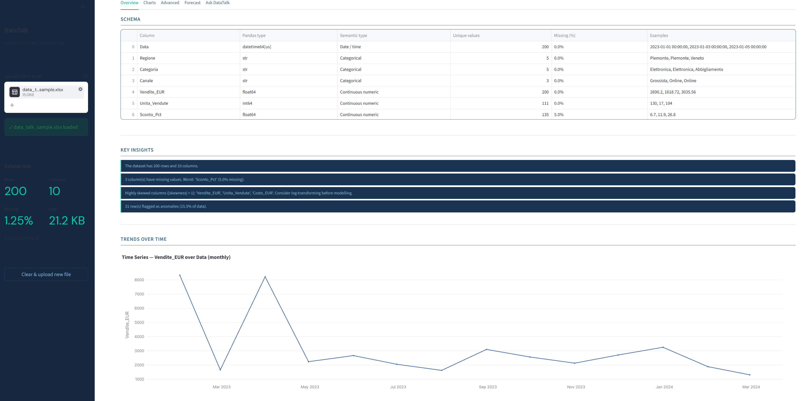

# Data_Talk

> Upload your data. Ask anything. Get answers in plain language.

Data_Talk is a web app built for small and medium businesses that work
with Excel and CSV files every day. No SQL, no code, no technical
knowledge required - just upload your file and start exploring.

Built as a portfolio project, with a focus on real-world usability
rather than the typical data collection and analysis exercises.

---

**Live demo → [data-talk.streamlit.app](https://data-talk.streamlit.app)**

> Sample screen — the app automatically analyses an Italian retail sales dataset


---

## Features

- **Smart file loading** - CSV and Excel (.xlsx, .xls) with automatic encoding detection and Italian decimal comma support
- **Automatic analysis** - descriptive statistics, missing value detection, correlation matrix, and anomaly detection via IQR
- **Interactive charts** - distributions, heatmaps, category bars, scatter plots, and time series via Plotly
- **Time-series forecasting** - Prophet (primary) with Linear Regression fallback
- **Natural language Q&A** - powered by Google Gemini 2.5 Flash; answers questions about your data in any language
- **Adaptive data strategy** - sends full data for small files, stratified samples for large ones
- **Per-session rate limiting** - protects the free API quota

---

## Tech Stack

| Layer | Tool |
|---|---|
| Web app | Streamlit |
| Data processing | Pandas, NumPy, SciPy |
| Visualisation | Plotly |
| Forecasting | Prophet / scikit-learn |
| AI agent | Google Gemini 2.5 Flash |
| Deploy | Streamlit Cloud |

---

## Run Locally

**1 — Clone the repository**
```bash
git clone https://github.com/YOUR_USERNAME/data_talk.git
cd data_talk
```

**2 — Create a virtual environment**
```bash
python -m venv .venv
.venv\Scripts\activate      # Windows
source .venv/bin/activate   # Mac/Linux
```

**3 — Install dependencies**
```bash
pip install -r requirements.txt
```

**4 — Get a free Gemini API key**

Go to [aistudio.google.com](https://aistudio.google.com), sign in, and create a free API key.

**5 — Create your `.env` file**
```bash
cp .env.example .env
```
Open `.env` and paste your key:
```
GEMINI_API_KEY=your_key_here
```

**6 — Run the app**
```bash
streamlit run app.py
```

Open [http://localhost:8501](http://localhost:8501) in your browser.

---

## Project Structure

```
Data_Talk/
├── app.py
├── modules/
│   ├── loader.py
│   ├── analyzer.py
│   ├── visualizer.py
│   ├── forecaster.py
│   └── agent.py
├── assets/
│   └── style.css
├── .env.example
├── requirements.txt
└── README.md
```

---

## Deploy on Streamlit Cloud

1. Push the repository to GitHub
2. Go to [share.streamlit.io](https://share.streamlit.io)
3. Connect your GitHub repo
4. Under **Advanced settings -> Secrets**, add:
```
GEMINI_API_KEY = "your_key_here"
```
5. Click **Deploy**

---

## Notes

- The free Gemini API tier allows 1,500 requests/day.
- The per-session limit of 20 questions is configurable - edit `QUESTION_LIMIT` in `agent.py`.
- Files under 5,000 rows send full data to the model. Larger files use a stratified sample.

---

## Feedback

This project is actively being developed and I would love to hear what you think — what you would change, what you would add, or what broke when you tried it.

Feel free to open a GitHub Issue or leave a comment on the LinkedIn post.

---

## Author

Built by **Davide Boccardo** - Data Analyst & Python Developer based in Turin, Italy.

[](https://linkedin.com/in/davide-boccardo-6775a6125)
[](https://github.com/davide-bocc)
